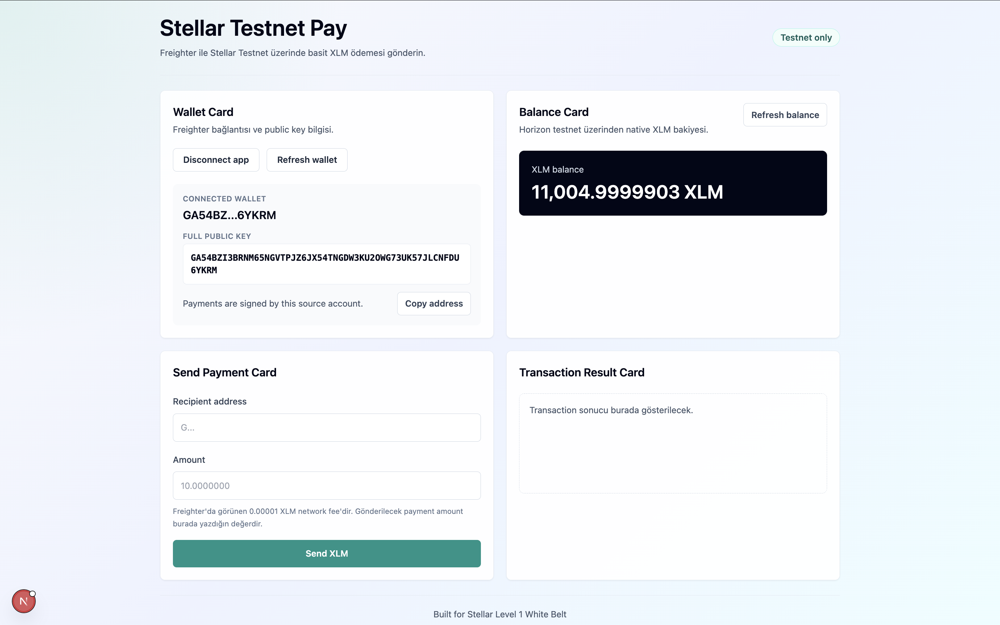
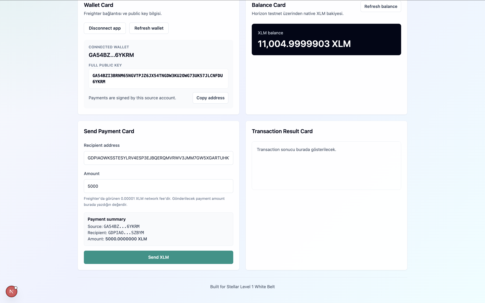
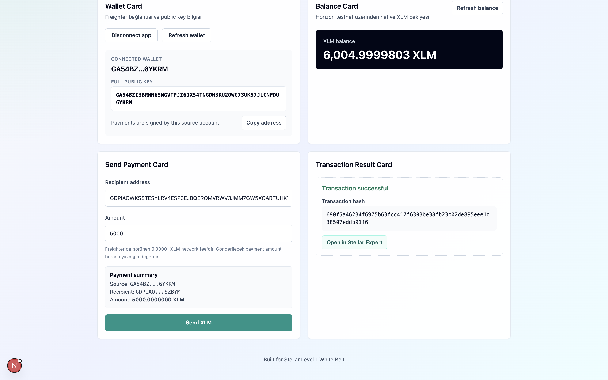

# Stellar Testnet Pay

Live Demo: https://stellar-testnet-pay.vercel.app/

A simple Stellar Testnet dApp built for Level 1 White Belt. Users can connect Freighter wallet, view XLM balance, and send XLM on Stellar Testnet.

## Features

- Connect and disconnect Freighter wallet
- Show the connected public key in short format
- Copy the connected wallet address
- Fetch native XLM balance from Stellar Testnet Horizon
- Show loading, empty, unfunded, success, and failure states
- Send native XLM to another Stellar testnet public key
- Sign transactions with Freighter without using secret keys
- Show transaction hash and Stellar Expert testnet explorer link

## Tech Stack

- Next.js App Router
- TypeScript
- Tailwind CSS
- `@stellar/freighter-api`
- `@stellar/stellar-sdk`
- Stellar Testnet Horizon
- Vercel-compatible project structure

## Setup Instructions

Install dependencies:

```bash
npm install
```

## How To Run Locally

Start the development server:

```bash
npm run dev
```

Open the local URL printed by Next.js, usually `http://localhost:3000`.

## How To Use The App

1. Install the Freighter browser extension.
2. Switch Freighter to Stellar Testnet.
3. Open the app and click `Connect Wallet`.
4. Confirm the connection in Freighter.
5. Check the XLM balance card.
6. Enter a recipient Stellar testnet public key and a positive XLM amount.
7. Click `Send XLM`.
8. Review and sign the transaction in Freighter.
9. Read the transaction result and open the Stellar Expert testnet link if successful.

## Testnet Note

This app is testnet only. It uses:

```text
https://horizon-testnet.stellar.org
```

Mainnet is not used anywhere in the transaction flow.

## Freighter Wallet Note

The app never asks for a secret key, private key, mnemonic, or seed phrase. Transactions are built in the browser and signed by Freighter.

If the connected account has not been funded on Stellar Testnet yet, the balance card shows:

```text
Bu hesap testnet üzerinde henüz fund edilmemiş olabilir.
```

## Submission Checklist

- [x] Next.js App Router project
- [x] TypeScript enabled
- [x] Tailwind CSS enabled
- [x] Freighter wallet connect
- [x] Wallet disconnect with state reset
- [x] Connected public key display
- [x] Copy address button
- [x] Stellar Testnet XLM balance
- [x] Horizon testnet endpoint
- [x] Refresh balance button
- [x] Unfunded account message
- [x] Recipient and amount form validation
- [x] Native XLM payment transaction
- [x] Freighter transaction signing
- [x] Horizon testnet transaction submit
- [x] Success and failure UI feedback
- [x] Transaction hash display
- [x] Stellar Expert testnet explorer link
- [x] Vercel-compatible build

## Screenshots





